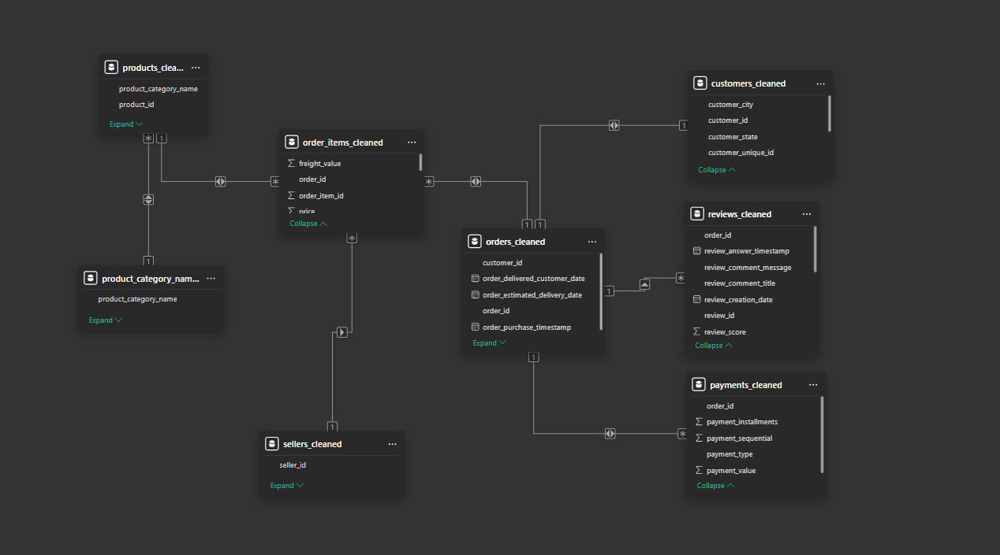
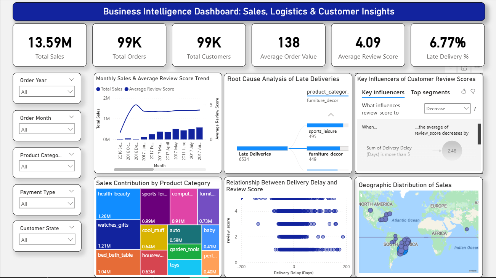

# Powerbi Sales Logistics Dashboard: SCGR

## Project Overview

This project presents an end-to-end Business Intelligence solution developed using Microsoft Power BI to analyse sales performance, logistics efficiency, and customer satisfaction within a Brazilian e-commerce business.

The objective was to transform raw transactional data into an interactive dashboard that supports data-driven decision-making by identifying sales trends, delivery bottlenecks, customer behaviour, and operational performance.

The project demonstrates the complete BI workflow, including data modelling, data transformation, dashboard development, business analysis, and actionable recommendations.


## Business Problem

The organisation required a centralised dashboard capable of answering key business questions such as:

- How is overall sales performance changing over time?
- Which product categories contribute the most revenue?
- What factors contribute to late deliveries?
- How do delivery delays affect customer satisfaction?
- Which regions generate the highest sales?
- Which operational areas require improvement?

The dashboard was designed to consolidate these insights into a single interactive analytical environment for business decision-makers.


## Dataset

**Source:** Brazilian E-Commerce Public Dataset by Olist (Kaggle)

The dataset contains approximately:

- 99,000 Orders
- 99,000 Customers
- Multiple relational tables covering:
  - Orders
  - Customers
  - Products
  - Payments
  - Reviews
  - Sellers


## Tools & Technologies

- Microsoft Power BI
- Power Query
- DAX
- Data Modelling
- Star Schema
- Microsoft Excel


## Skills Demonstrated

- Business Intelligence
- Data Cleaning & Transformation
- Data Modelling
- Star Schema Design
- DAX Calculations
- KPI Development
- Dashboard Design
- Data Storytelling
- Root Cause Analysis
- Business Recommendations


## Data Model

The dashboard was built using a relational star-schema model to optimise performance and ensure accurate analytical relationships between the business entities.




## Dashboard Overview

The dashboard combines executive KPIs, sales analysis, logistics performance, customer review analysis, and geographic insights into a single interactive reporting environment.




## Dashboard Features

The dashboard includes:

- Executive KPI Cards
- Monthly Sales Trend Analysis
- Average Customer Review Analysis
- Root Cause Analysis using Decomposition Tree
- Key Influencers Analysis
- Product Category Sales Treemap
- Delivery Delay vs Customer Review Scatter Plot
- Geographic Sales Distribution
- Interactive Slicers for dynamic filtering


## Key Business Insights

Some of the key findings include:

- Generated total sales of **13.59M** across approximately **99K orders**.
- Approximately **6.77%** of orders experienced late delivery.
- Delivery delays greater than five days significantly reduced customer review scores.
- High-revenue product categories also experienced relatively high delivery delays, highlighting operational improvement opportunities.
- Sales activity was concentrated primarily within Brazil's South and Southeast regions.


## Business Recommendations

Based on the dashboard analysis:

- Improve logistics performance within high-delay product categories.
- Strengthen delivery performance in regions with frequent delays.
- Monitor underperforming sellers more closely.
- Improve delivery reliability to increase customer satisfaction.
- Expand future BI capabilities through predictive analytics and enhanced logistics data.


## Repository Structure

```
PowerBI-Brazilian-Ecommerce-Dashboard
│
├── images/
├── reports/
├── data/
├── README.md
```


## Technical Report

A detailed technical report documenting the project methodology, dashboard design decisions, analytical findings, business recommendations, and supporting references is available in the **reports** folder.


## Power BI Dashboard File

The Power BI (.pbix) file is available for download via OneDrive:

**Download Dashboard (.pbix)**

(https://1drv.ms/u/c/de6a885ec56899f9/IQCq00VITUXTRqp66c7pLEbdAT142Gouvuh2ws6FA4Ctolc?e=GNbE0Q))

---

## Note

Due to organisational sharing restrictions associated with the Microsoft Power BI tenant provided through my university, the interactive dashboard could not be published publicly using Power BI Service.

To ensure the project remains fully accessible, dashboard screenshots, a downloadable Power BI (.pbix) file, and a comprehensive technical report have been included within this repository.


